# Introducción

Vamos a introducir el uso de 2 fuentes de vídeo diferentes en los vídeos grabados. En este primer ejercicio, tan solo introduciremos una cámara fija que nos mostrará a nosotros mismos en el vídeo.

# Tarea 02

Para la realización de esta tarea se recomienda la visualización de los vídeos:

- [ Videotutorial ] - OBS : Filtros de Sonido
- [ Videotutorial ] - OBS : Subtitulando
- [ Resultado ] - OBS : WebCam + Filtros

Que tenéis disponibles en la plataforma en la Unidad 03.

## Capturas

A diferencia de las otras tareás en este caso no puedo contar con un vídeo donde se explique cómo se conecta la cámara, ya que no se permite que hayan dos instancias del *OBS* ejecutándose a la vez. 

Así que contaréis con una serie de capturas en la tarea que explicarán cómo poner en marcha la cámara y ajustarla en la escena para que forme parte del vídeo.

## Pasos

Primero añadiremos a nuestra lista de fuentes disponibles para la escena la WebCam que tengamos disponible.

\

Una vez añadida, nos mostrará una ventana donde podremos configurar el perfil de color de la cámara, el zoom, etc.
Para este primer vídeo dejaremos los parámetros que vienen por defecto.

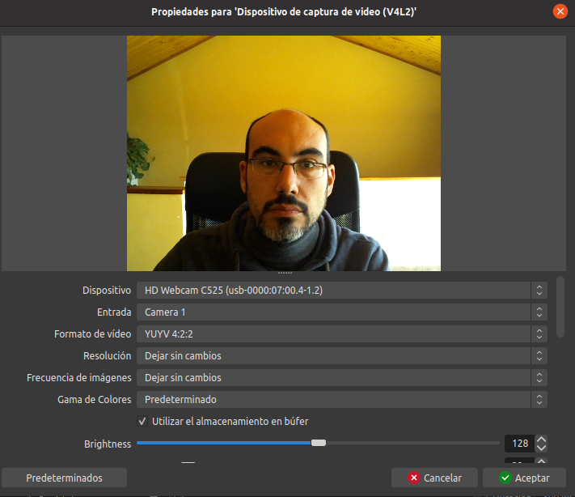\

Si hacemos *scroll* veremos que hay muchas opciones que podríamos aplicar aquí, pero tal y como hemos comentado antes, no hace falta modificar por ahora.

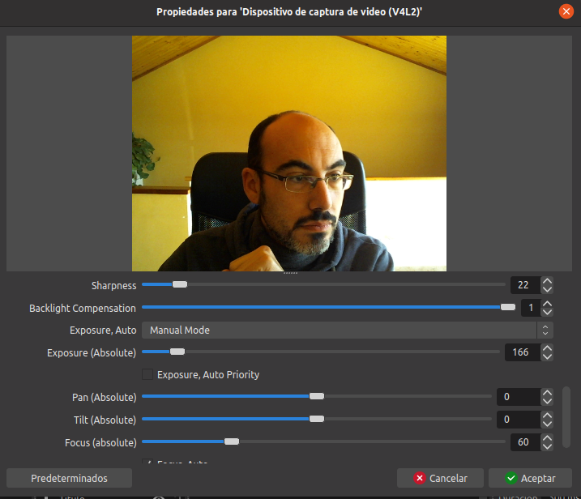\

Una vez tenemos la fuente añadida, la situaremos en nuestra escena en el punto que deseemos.

En este caso se ha preparado para grabar un pequeño vídeo en el que se mostrará cómo queda todo cuando apliquemos los filtros.

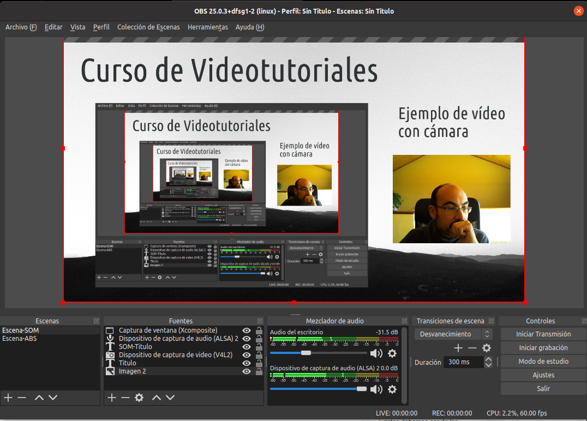\

**Disclaimer** : Puede parecer vanidoso salir en unos materiales, pero como el objetivo es acostumbrarnos a vernos a nosotros mismos en los videotutoriales (así como a oir nuestra propia voz), he decidido ir apareciendo de para que parezca más *natural*.

## Filtros

Vamos a aplicar 2 filtros a la captura de vídeo para que quede mejor integrada dentro de la escena.

Para ello pulsaremos el botón derecho sobre la fuente y seleccionaremos la opción : *filtros*.

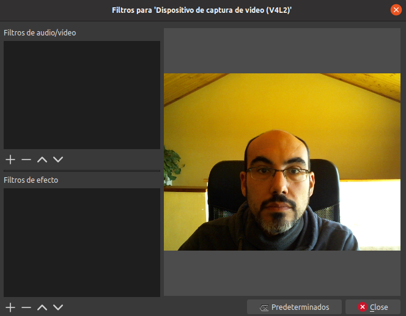\

En los filtros de *efecto* pulsaremos el botón que tiene el símbolo "+" y elegiremos los filtros que más nos interesen. 

Para esta práctica hemos elegido el filtro LUT y el de recorte.

Los describiremos acontinuación.

### Filtro LUT

Los filtros LUT se encargan de traducir los parámetros de una fuente/imágen a los de otra que se toma como muestra. Es decir, si elegimos como filtro LUT una imagen que tan sólo tenga tonos verdes, el filtro hará un procesado de la cámara para que toda la imágen sea en esos tonos (dentro de lo posible). En esta práctica se ha utilizado la imágen de ejemplo que viene en la instalación de OBS como "Blanco y Negro".

Para crear este filtro, pulsaremos sobre el botón de "+" y elegimos "LUT". Dejamos el nombre que nos viene por defecto.

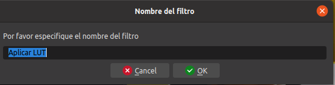\

En la caja de "Ruta", pulsaremos el botón "Examinar" y buscaremos la imágen que utilizaremos como muestra.

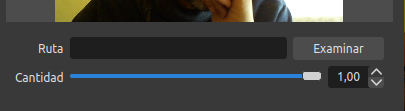\

En nuestro ejemplo hemos elegido : `black_and_white.png`.

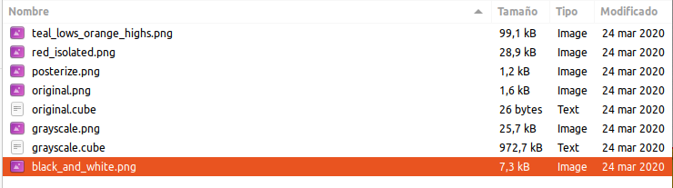\

*OBS* transforma la entrada de la cámara "en directo", mostrando cómo va a quedar nuestra entrada.

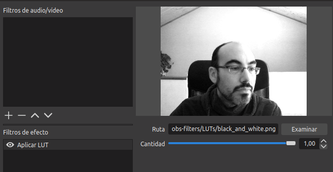{ height=256px}\

### Filtro imágen máscara/mezcla

En este filtro se utiliza una imágen para darle forma al vídeo. Se aplica un *recorte* utilizando una imágen.

En esta práctica hemos utilizado esta imágen :

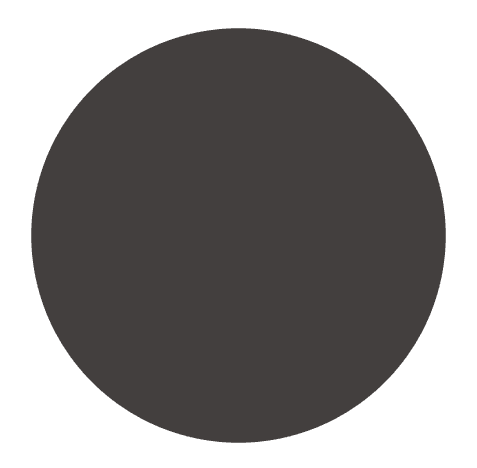{ height=256px} \

Un círculo para crear un recorte circular sobre la entrada de vídeo de la cámara.

Podéis encontrar el `circulo.png` en el Moodle del CEFIRE, junto con esta práctica, aunque podéis utilizar cualquier imágen con fondo transparente que queráis.

Para crear el filtro, seguiremos los pasos habituales.

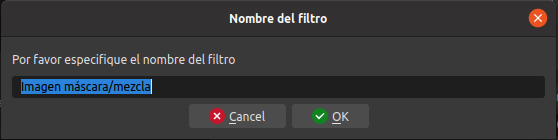\

Cuando aplicamos el filtro, deberemos buscar en *Ruta* la imágen.

\

Por defecto el tipo de filtro es "*Máscara alfa (canal de color)*" y deberemos cambiarlo a "*Máscara alfa (canal Alpha)*"

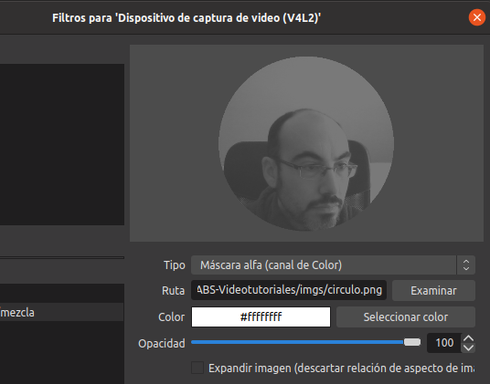\

Al cambiarlo pasaremos de verlo más nítido:

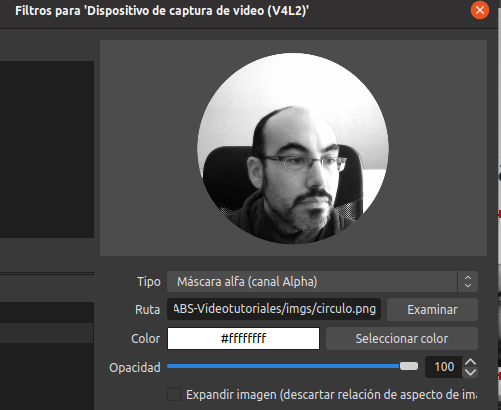\

Por último podéis visualizar el vídeo que tenéis en la plataforma para ver cómo puede quedar.

\newpage
# Tarea

Configurad vuestra WebCam y usad estos filtros para grabar un pequeño vídeo donde se aprecie que se han aplicado.

En el vídeo debéis aparecer vosotr@s explicando algún concepto de una página web, documento PDF, lo que queráis relacionado con vuestros contenidos.

Algunos ejemplos:

- Usando un PDF de Montaje de IKEA, describir los pasos para el montaje del mueble.
- Usando fotos de vertebrados e invertebrados ir coméntando a los espectadores qué tipo es.
- Utilizando obras pictóricas, ir describiendo que movimiento artístico las define mejor.
- ...

La temática la elegís vosotr@s.

