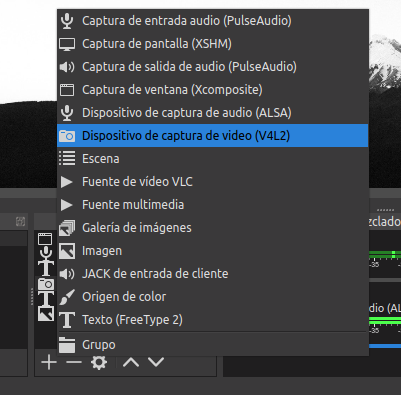

# Introducción

Vamos a introducir el uso de 2 fuentes de vídeo diferentes en los vídeos grabados. En este primer ejercicio, tan solo introduciremos una cámara fija que nos mostrará a nosotros mismos en el vídeo.

# Tarea 02

Para la realización de esta tarea se recomienda la visualización de los vídeos:

- [ Videotutorial ] - OBS : Filtros de Sonido
- [ Videotutorial ] - OBS : Subtitulando
- [ Resultado ] - OBS : WebCam + Filtros

Que tenéis disponibles en la plataforma en la Unidad 03.

## Capturas

A diferencia de las otras tareás en este caso no puedo contar con un vídeo donde se explique cómo se conecta la cámara, ya que no se permite que hayan dos instancias del *OBS* ejecutándose a la vez. 

Así que contaréis con una serie de capturas en la tarea que explicarán cómo poner en marcha la cámara y ajustarla en la escena para que forme parte del vídeo.

## Pasos

Primero añadiremos a nuestra lista de fuentes disponibles para la escena la WebCam que tengamos disponible.

\

Por último podéis visualizar el vídeo que tenéis en la plataforma para ver cómo puede quedar.

- [ Resultado ] - OBS Tarea 02 : WebCam + Filtros

La temática la elegís vosotr@s.

