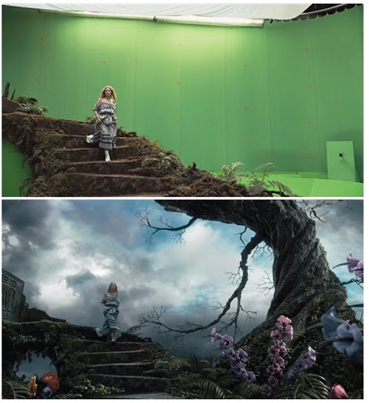

# Introducción

Continuamos en esta tarea con el uso de la Cámara para crear efectos atractivos o que nos permitan crear un contenido de más alta calidad y complejidad.

Vamos ver en esta tarea el uso de un fondo de Croma.

La clave croma es una técnica que se utiliza en el mundo del cine y la televisión en la que se retira de una imágen todos aquellos puntos que contienen o se acercan a un determinado color (Clave Croma). Todos esos puntos quedan transparentes y permiten que se vea la imágen que se encuentra justo detrás.

\

En nuestro vídeo esto se puede utilizar para hacer desaparecer el fondo de la cámara, situando lo que nosotros estamos grabando sobre una determinada imágen o vídeo.

# Tarea 01

Visualizad el vídeo de la preparación, seguid lo pasos y cread un vídeo vosotr@s adecuado a vuestros contenidos.

Algunas ideas:

- Marionetas sobre un vídeo de YouTube.
- Vosotros participando en un debate de un cuadro.
- Uso de una foto para explicar un determinado concepto.

