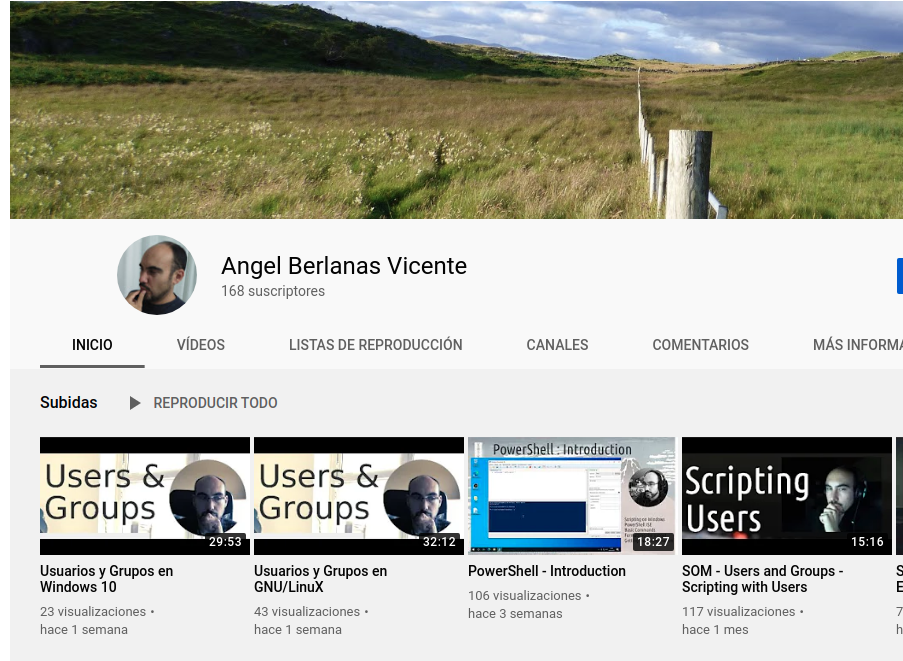
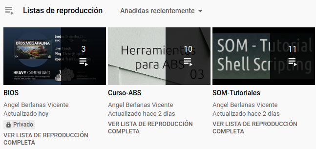
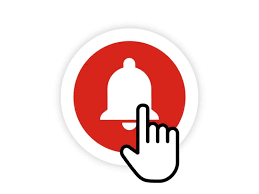

# Introducción

En esta unidad aprenderemos algunos conceptos acerca de las diferentes plataformas de Vídeos y cómo realizar una Subida de un vídeo a YouTube, así cómo realizar una retransmisión en directo.

# YouTube

Esta plataforma de vídeos ya tiene 16 años. En sus inicios no pertenecía a Google, pero fué comprado por el Gigante de Internet e integró sus servicios de Vídeo, Música y Streaming para todos los usuarios. 

Se ha transformado en un referente en Internet, siendo sus vídeos y sus publicadores una de las mayores fuentes de tráfico de toda Internet. 

## YouTube para el mundo educativo

Existen multitud de canales de divulgación de muchísimos temas, algunos puestos en marcha por las propias Universidades y Organizaciones:

- NASA.
- Universidades.
- Colegios.
- Colectivos.

Se pueden encontrar contenidos de muchísimos temas (y cada día más) relacionados con el mundo de la cultura y la educación.

El alumnado cada vez busca más en esta plataforma a la hora de solucionar los problemas que se le plantean, ya sean situaciones planteadas desde el mundo académico, como desde el personal.

La posibilidad de ofrecer contenidos educativos en este tipo de plataformas, e integrarlos con nuestra docencia, hace posible que el alumnado consulte explicaciones, demostraciones, etc. a cualquier hora y siempre que tenga el problema. 

\newpage
# Algunas características de YouTube

No es el objetivo de este curso realizar un análisis exhaustivo del funcionamiento de YouTube, pero si que vale la pena que destaquemos algunos conceptos que pueden sernos de utilidad.

## Canales

Cada usuario dispone de un *Canal* (Cómo mínimo),  se trata de una página en la que van apareciendo todos los vídeos que se van subiendo y pertenecen a dicho usuario. Se pueden poner descripciones, avisos de próximos directos, etc.

\

*Disclaimer:* Parece que estoy haciendo publicidad de mi canal, pero en absoluto, lo que ocurre es que prefiero poner ejemplos de cómo lo veréis vosotr@s cuando creéis el vuestro.

## Listas de Reproducción

Ya sea como creador de contenido (aka *YouTuber*) o como consumidor, YouTube nos permite crear *Listas de Reproducción*, que no són más que una serie de vídeos encadenados (reproducidos de manera consecutiva) y con un orden en concreto. 

En el mundo de la docencia puede ser interesante crear Lista de Reproducción por *Unidades de contenidos* o *Temas*. Algunos ejemplos posibles:

- Colores
  - Vídeo sobre el Azul.
  - Vídeo sobre el Rojo.
  - Vídeo sobre los *colores primarios*.

- Tipos de Escalas Musicales
  - Vídeo sobre la Escala Pentatónica.
  - Vídeo sobre la Escala Dórica.

- Bucles
  - Vídeo sobre el bucle `for`.
  - Vídeo sobre el bucle `While`.
  - Vídeo sobre el bucle `until`.
  - Vídeo sobre el bucle `forEach`.

Estas Listas de Reproducción pueden ser Privadas o Publicas, si son privadas, tan solo tú podrás verlas y reproducirlas, si son públicas otros usuarios pueden utilizarlas para reproducir los vídeos en el orden que tú los has seleccionado.

\

## Comentarios y Likes

Los vídeos de YouTube pueden permitir comentarios, o no, se trata de una decisión del creador del contenido. Cuando un vídeo se sube a la plataforma se puede decidir si se permitirán comentarios o no.

Los *likes* o *me gusta* son un mecanismo de puntuación que usa YouTube para promocionar y ordenar vídeos.

## Suscribirse y Campanita

Si nos suscribimos a un determinado canal nos aparecerá en YouTube cuando entremos en nuestra cuenta, el contenido (o contenidos nuevos) que un creador ha subido desde nuestra última visita a su canal. Puede ser interesante para seguir determinados canales.

La famosa *campanita*, es hacer que YouTube te avise de cualquier novedad que ocurra en un canal al que estás suscrito.

\

## Retransmisiones en Directo

Aunque al comienzo YouTube carecía de este servicio, se ha ido haciendo más popular con el paso del tiempo, para hacerle la competencia a otras plataformas de Streaming como *Twitch*. Una Retransmisión en directo es un vídeo que se está grabando al mismo tiempo que se reproduce en *YouTube*. 

Este tipo de vídeos suelen contar con un *Chat en directo* que se utiliza para contestar a los espectadores y recibir *feedback*. 

Existen multitud de retransmisiones en directo de una gran cantidad de temas:

- Radios musicales.
- Parques naturales.
- Nidos de aves.
- Cámaras de tráfico.
- Lugares emblemáticos de grandes ciudades.

Seguro que se os pueden ocurrir ideas para utilizar este tipo de Retransmisiones con el alumnado.

Además YouTube luego guarda la retransmisión como si de un vídeo subido se tratara, de tal manera que el material audiovisual queda almacenado.