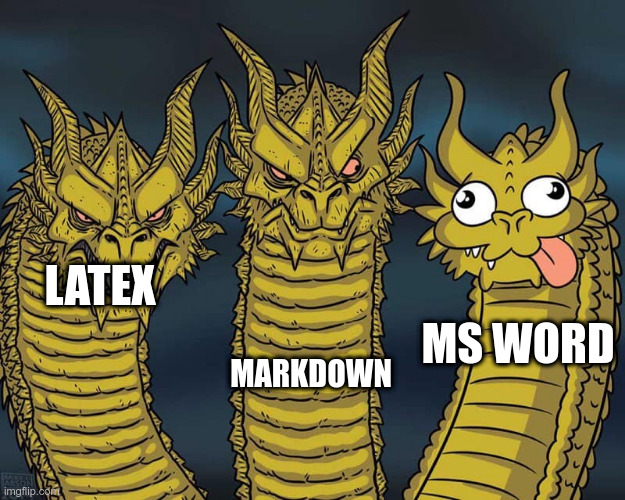
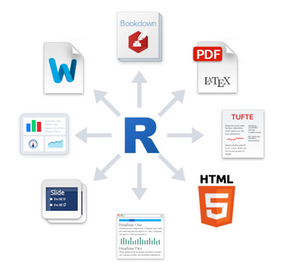

# ¿Cómo empecé con esto?

 * Apuntes para un módulo de FP.

 * ¿Cómo había trabajado yo hasta ese momento?.

 * Homogeneidad y estilos.

 * WYSIWYG vs WYSIWYM vs Markdown.

# ¿Qué és Markdown?

 * Lenguaje de Marcado Ligero.

 * Aleja el estilo de lo que estás escribiendo.

 * Minimalismo.

 * Te ayuda a poner foco en lo que estás haciendo.

 * Imágenes + Actualizaciones

# Edición
 
 * Puedes usar cualquiera, en cualquier momento, incluso en GitHub.

 * Los editores de WYSIWYG son un *Atraso*.

 * *Set* básico de herramientas de manejo de ficheros de texto.

 * Todos los *plugins* que puedas imaginar a tu disposición.

 * Puedes usar el `vim`, el `emacs`, el `vscode`,... 

{width=250px}\

# Editores de Markdown visuales

 * WriteMonkey

 * Typora

 * Joplin

 * Mark Text

 * Zettlr

# ¿Cómo funciona?

## Encabezados

 * `# Encabezado 1`
 * `## Encabezado 2`
 * `### Encabezado 3`

## Negrita, y cursiva

 * `*Cursiva*` $\longrightarrow$ *Cursiva*
 * `**Negrita**` $\longrightarrow$ **Negrita**

# Tablas

```shell
 | Columna 1 | Valor |
 |:---------:|:-----:|
 | Castellon | 12xxx |
 | Valencia  | 46xxx |
 | Alicante  | 03xxx |

```

 | Columna 1 | Valor |
 |:---------:|:-----:|
 | Castellon | 12xxx |
 | Valencia  | 46xxx |
 | Alicante  | 03xxx |


# Listas

## Listas (ul)

```markdown
 * Lista sin números
 * Elemento random
 * Elemento random
```

 * Lista sin números
 * Elemento random
 * Elemento random

## Listas (ol)

```markdown
 1. Elemento 1
 2. Elemento 2
 3. Elemento 3
```
 1. Elemento 1
 2. Elemento 2
 3. Elemento 3

# Enlaces e Imágenes

## Enlaces

```shell
[Pandoc](https://pandoc.org/)
```

[Pandoc](https://pandoc.org/)

## Imágenes

```markdown
\
```

{width=200px}\

# Potencia

 * `\tableofcontents`

 * `\listoffigures`

 * También se pueden poner notas al pié[^1]

[^1]:Esto es una nota al pié

# LaTeX

Al final, todo pasar a ser *LaTeX* y se nota. Markdown nos permite escribir fórmulas, gráficos y cualquier cosa que quisiéramos 
especialmente compleja.

```markdown
$$V = \frac{4}{3}\pi r^3$$
```

$$
V = \frac{4}{3}\pi r^3
$$

# Codigo fuente

La potencia de poder poner fragmentos de código fuente en los apuntes está fuera del alcance de otro tipo 
de editores de texto.


```Markdown
```python
count = 1
target = 100
while count < target:
  print(" Vamos por "+str(count))
  count = count + 1 
```

Y podemos hacer que se evalúe y se ejecute ahí dentro. 

# R-Markdown

Aprovechando esta potencia, el lenguaje de cálculos estadísticos `R` ha desarrollado un subconjunto de 
Markdown, denominado *R-Markdown*, que permite insertar código.

{width=100 height=300px float=right .center}\

 * [R-Markdown-Editor](https://rstudio.github.io/visual-markdown-editing/)

 * [R-Markdown-Curso](https://rmarkdown.rstudio.com/lesson-1.html)

# Plantillas y exportación

 Se pueden dividir los apuntes por tareas, temas por carpetas, o cualquier combinación que se requiera.

 Utilizando 

 * [ Pandoc ](https://pandoc.org/)

 * [ Eisvogel ](https://github.com/Wandmalfarbe/pandoc-latex-template)

 Le aplicaremos plantillas y lo podremos exportar a diferentes formatos:
 
 - pdf, html, rtf, odt, docx, ...

# GitHub/GitLab/... 

 Y todo esto disponible en Internet y para tod@s. 

 Algunos enlaces propios

 * [GitHub - SMX - SOX](https://github.com/aberlanas/SMX-SOX)
 * [GitHub - SMX - SOM](https://github.com/aberlanas/SMX-SOM)
 * [GitHub - ASIR - ISO](https://github.com/aberlanas/ASIR-ISO)

 Colaborando por toda España

 * [ApuntesFPInformática](https://apuntesfpinformatica.es/)

# Algunas Reflexiones

*Dentro de 20 años podré leer el código de mis apuntes, no sé si lo necesitaré, pero sé que podré, por que son texto plano.*

                    *Usuaria de Emacs* **Onda Hostil**

# Gracias por su atención


